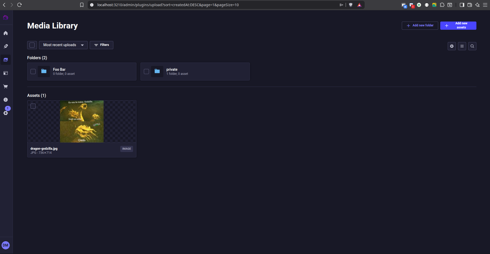

# strapi-provider-upload-local-secure

[](https://www.npmjs.com/package/strapi-provider-upload-local-secure)
[](https://www.npmjs.com/package/strapi-provider-upload-local-secure)
[](https://github.com/dansp89/strapi-provider-upload-local-secure/blob/main/LICENSE)
[](https://nodejs.org)
[](https://strapi.io)



**Enhanced fork** of the default Strapi local upload provider with:
- Admin folder support (`data.path`)
- Filesystem subdirectory support (`data.pathDir`, NFD + sanitized)
- Robust deletion (main file + formats) even when Strapi provides partial metadata

> **README targets v1.0.0 behavior** (this package’s current version).

> **This is a modified version** of the official `@strapi/provider-upload-local` with additional features for better file organization.

## ✨ What's Different from the Original

This provider extends the original local provider with **two independent concepts**:

- ✅ **Admin folders (Media Library)** via `data.path` (creates folder hierarchy in the DB and assigns `fileInfo.folder`)
- ✅ **Filesystem directories** via `data.pathDir` (NFD normalized + sanitized)
- ✅ **Multi-upload** support (`files: []` + `fileInfo: []`)
- ✅ **Replace compatibility** (`upload.replace(...)` is also patched when available)
- ✅ **Robust delete**: deletes the main file even if Strapi does not provide `ext/path` consistently
- ✅ **Optional cleanup** of empty directories after deletion
- ✅ **Backward compatibility**: if `pathDir` is missing, `path` can also be used as filesystem directory (configurable)
- ✅ **Private folder** with **secure URLs**: JWT or HMAC-signed time-limited URLs (`?token=...&expires=...`) for access control

## 🚀 Features

- **Admin folder support**: `data.path` creates/targets Media Library folders (DB only; folders remain “virtual”)
- **Filesystem directory support**: `data.pathDir` controls physical subdirectories under `public/uploads`
- **NFD + sanitization**:
  - `pathDir` is sanitized for safe filesystem paths
  - `path` is sanitized for safe Admin folder names
- **Multi-upload**: handles `fileInfo` as an array (one entry per file)
- **Replace support**: keeps behavior consistent for `upload.replace(...)` when present
- **Robust delete**: path/url/ext inference + safe scanning under uploads root
- **Optional cleanup**: remove empty parent directories after deletion (`cleanupEmptyDirs`)
- **Private folder with secure URLs**: optional private uploads with access via Admin JWT, user JWT (documentId match), or HMAC-signed time-limited URLs
- **Strapi v5 compatible**

## 📦 Installation

### Using yarn
```bash
yarn add strapi-provider-upload-local-secure
```

### Using npm
```bash
npm install strapi-provider-upload-local-secure --save
```

### Using bun
```bash
bun add strapi-provider-upload-local-secure
```

## ⚙️ Configuration

### Provider Configuration

**For TypeScript projects** - `config/plugins.ts`:
```ts
export default () => ({
  upload: {
    config: {
      // Required
      provider: 'strapi-provider-upload-local-secure',

      // Optional (all providerOptions below are optional)
      providerOptions: {
        // Optional: enable debug logs (upload/delete resolution)
        // Also supports env: STRAPI_PROVIDER_UPLOAD_LOCAL_PATH_DEBUG=1
        debug: false,

        // Optional: if `pathDir` sanitizes to an empty string, throw instead of falling back
        strictPathDir: false,

        // Optional: after deleting a file, attempt to remove empty parent directories under `public/uploads`
        cleanupEmptyDirs: false,

        // Optional: after deleting a file, attempt to delete empty Media Library folders (Admin) as well.
        // Safety rules:
        // - only deletes a folder if it has no child folders
        // - only deletes a folder if it has no other files (excluding the file currently being deleted)
        // - then repeats the same check for the parent folder (recursive upwards)
        cleanupEmptyAdminFolders: false,

        // Optional (default: true): if `pathDir` is not provided, use `path` as the filesystem directory
        // If you want `path` to be Admin-only and never affect filesystem paths, set this to false.
        usePathAsPathDir: true,

        // Optional (default: "/uploads/"): marker used to extract objectPath from `file.url` during delete
        uploadsUrlMarker: '/uploads/',

        // Optional (default: false): save files as <uuidv4>_<hash>.ext for unique, non-guessable filenames
        renameToUuid: false,

        // Optional: private folder (access via Admin JWT, user JWT with matching documentId, or HMAC-signed URL)
        privateEnable: false,
        privateFolder: 'private',
        privateTTL: 60,
        privateSecret: '',
        privateUserDocumentIdField: 'id',
      },
    },
  },
});
```

**For JavaScript projects** - `config/plugins.js`:
```js
module.exports = ({ env }) => ({
  upload: {
    config: {
      // Required
      provider: 'strapi-provider-upload-local-secure',

      // Optional (all providerOptions below are optional)
      providerOptions: {
        // Optional: enable debug logs (upload/delete resolution)
        // Also supports env: STRAPI_PROVIDER_UPLOAD_LOCAL_PATH_DEBUG=1
        debug: false,

        // Optional: if `pathDir` sanitizes to an empty string, throw instead of falling back
        strictPathDir: false,

        // Optional: after deleting a file, attempt to remove empty parent directories under `public/uploads`
        cleanupEmptyDirs: false,

        // Optional: after deleting a file, attempt to delete empty Media Library folders (Admin) as well.
        // Safety rules:
        // - only deletes a folder if it has no child folders
        // - only deletes a folder if it has no other files (excluding the file currently being deleted)
        // - then repeats the same check for the parent folder (recursive upwards)
        cleanupEmptyAdminFolders: false,

        // Optional (default: true): if `pathDir` is not provided, use `path` as the filesystem directory
        // If you want `path` to be Admin-only and never affect filesystem paths, set this to false.
        usePathAsPathDir: true,

        // Optional (default: "/uploads/"): marker used to extract objectPath from `file.url` during delete
        uploadsUrlMarker: '/uploads/',

        // Optional (default: false): save files as <uuidv4>_<hash>.ext for unique, non-guessable filenames
        renameToUuid: false,

        // Optional: private folder (access via Admin JWT, user JWT with matching documentId, or HMAC-signed URL)
        privateEnable: false,
        privateFolder: 'private',
        privateTTL: 60,
        privateSecret: '',
        privateUserDocumentIdField: 'id',
      },
    },
  },
});
```

## 🎯 Usage Examples

To use `path`, `pathDir`, or `private`, you must call the upload service from your own API (e.g. custom routes/controllers) or extend the upload plugin controller. The default Strapi upload (Admin drag-and-drop or `POST /api/upload`) does not pass these options to the provider unless you extend it.

**Custom route example:** For a full example with controller, custom route, Swagger and permissions, see [Custom route with path, pathDir and private](https://github.com/dansp89/strapi-provider-upload-local-secure/blob/main/docs/NATIVE_UPLOAD_PATH_AND_SWAGGER.md).

### Basic Usage (Backward Compatible)

**TypeScript:**
```ts
async upload(ctx) {
  try {
    const user = ctx.state.user;
    if (!user) return ctx.unauthorized('User not authenticated');

    const { files } = ctx.request;
    if (!files?.file) return ctx.badRequest('No file uploaded');

    const file = Array.isArray(files.file) ? files.file[0] : files.file;

    const result = await strapi.plugin('upload').service('upload').upload({
      data: {
        path: 'custom-folder',
        pathDir: 'custom-folder',
        ref: 'api::documents.documents',
        refId: document.id,
        field: 'documentFile',
        fileInfo: {
          name: file.originalFilename,
          caption: 'Document file',
        },
      },
      files: file,
    });
    return result;
  } catch (error) {
    return ctx.badRequest(error.message);
  }
}
```

**JavaScript:**
```js
async upload(ctx) {
  try {
    const user = ctx.state.user;
    if (!user) return ctx.unauthorized('User not authenticated');

    const { files } = ctx.request;
    if (!files?.file) return ctx.badRequest('No file uploaded');

    const file = Array.isArray(files.file) ? files.file[0] : files.file;

    const result = await strapi.plugin('upload').service('upload').upload({
      data: {
        path: 'custom-folder',
        pathDir: 'custom-folder',
        ref: 'api::documents.documents',
        refId: document.id,
        field: 'documentFile',
        fileInfo: {
          name: file.originalFilename,
          caption: 'Document file',
        },
      },
      files: file,
    });
    return result;
  } catch (error) {
    return ctx.badRequest(error.message);
  }
}
```

### Dynamic Path Organization

Use:
- `path`: to organize in the **Admin (Media Library)** (creates the folder hierarchy if needed)
- `pathDir`: to organize in the **filesystem** (subdirectories under `public/uploads`)

If `pathDir` is not provided, the provider also uses `path` as the physical directory (compatibility).

**TypeScript:**
```ts
const result = await strapi.plugin('upload').service('upload').upload({
  data: {
    path: `user-${userId}`,
    pathDir: `user-${userId}`,
    ref: 'api::documents.documents',
    refId: document.id,
    field: 'documentFile',
    fileInfo: {
      name: file.originalFilename,
      caption: `Document for user ${userId}`,
      alternativeText: `Document for user ${userId}`,
    },
  },
  files: file,
});
// Files will be saved in: uploads/user-123/[hash].ext
// URL will be: /uploads/user-123/[hash].ext
```

**JavaScript:**
```js
const result = await strapi.plugin('upload').service('upload').upload({
  data: {
    path: `user-${userId}`,
    pathDir: `user-${userId}`,
    ref: 'api::documents.documents',
    refId: document.id,
    field: 'documentFile',
    fileInfo: {
      name: file.originalFilename,
      caption: `Document for user ${userId}`,
      alternativeText: `Document for user ${userId}`,
    },
  },
  files: file,
});
```

### Private folder (`privateEnable: true`)

When `privateEnable` is true, you can upload files as private by setting `data.private: true` and `data.pathDir` to the **user's document ID** (e.g. `user.id` or your custom documentId field). The file is stored under `/uploads/<privateFolder>/<documentId>/` and appears in the Admin Media Library with full access (view, move, delete). Via URL, access is allowed only if:

- The request has a valid **Admin JWT** (Bearer), or  
- The request has a valid **users-permissions JWT** (Bearer) and the user's documentId (e.g. `user.id`) matches the path segment, or  
- The URL has a valid **HMAC** query (`?token=...&expires=...`) signed with `privateSecret` and not expired (within `privateTTL` seconds).

Otherwise the server returns **403**. The same logic applies everywhere (API and Admin): use Bearer or a signed URL. The provider patches the upload service so that **find** and **findOne** return **signed URLs** for private files; so in the Admin Library (and anywhere that uses those endpoints) the link you open or copy already has `?token=...&expires=...` and works.

**TypeScript:**
```ts
const user = ctx.state.user;
if (!user) return ctx.unauthorized();

const documentId = String(user.id); // or user.documentId if privateUserDocumentIdField: 'documentId'

const result = await strapi.plugin('upload').service('upload').upload({
  data: {
    pathDir: documentId,
    private: true,
    ref: 'api::documents.documents',
    refId: document.id,
    field: 'documentFile',
    fileInfo: {
      name: file.originalFilename,
      caption: 'Private file',
    },
  },
  files: file,
});
// File saved in: uploads/private/<documentId>/[hash].ext
// URL: /uploads/private/<documentId>/[hash].ext
// Access: Admin JWT, user JWT (documentId match), or HMAC-signed URL.
```

**JavaScript:**
```js
const user = ctx.state.user;
if (!user) return ctx.unauthorized();

const documentId = String(user.id); // or user.documentId if privateUserDocumentIdField: 'documentId'

const result = await strapi.plugin('upload').service('upload').upload({
  data: {
    pathDir: documentId,
    private: true,
    ref: 'api::documents.documents',
    refId: document.id,
    field: 'documentFile',
    fileInfo: {
      name: file.originalFilename,
      caption: 'Private file',
    },
  },
  files: file,
});
```

**Note:** The provider registers a middleware that intercepts `GET /uploads/<privateFolder>/*` and checks auth before serving. If private files are served without auth, ensure this middleware runs before Strapi's static file middleware (e.g. load the upload plugin early or adjust middleware order in your app).

**About moving files in the Admin Media Library**

Moving a file from one folder to another in the Admin (e.g. from "Documents" to "Private", or the other way around) **does not change** whether the file is public or private. That is decided when the file is uploaded: private files are stored in a special protected path on the server, and public files elsewhere. Moving between folders only changes how you organize them in the Media Library—it does not move the file on the server or update its access rules.

In short: **private files stay private** even if you move them to another folder, and **public files stay public** even if you move them. To change access, you would need to re-upload the file with the desired settings.

### Multi-upload (multiple files at once)

Strapi supports uploading multiple files in one call. In that case, `files` is an array and `fileInfo` should be an array with the same order:

**TypeScript:**
```ts
await strapi.plugin('upload').service('upload').upload({
  data: {
    path: 'Documents',
    pathDir: 'documents',
    fileInfo: [
      { name: 'a.png', caption: 'A' },
      { name: 'b.png', caption: 'B' },
    ],
  },
  files: [fileA, fileB],
});
```

**JavaScript:**
```js
await strapi.plugin('upload').service('upload').upload({
  data: {
    path: 'Documents',
    pathDir: 'documents',
    fileInfo: [
      { name: 'a.png', caption: 'A' },
      { name: 'b.png', caption: 'B' },
    ],
  },
  files: [fileA, fileB],
});
```

### Replace compatibility (`upload.replace`)

When replacing an existing upload (keeping the same DB entry), Strapi calls `upload.replace(id, { data, file })`.
This provider patches `replace` too (when present) so `path` / `pathDir` behave the same:

**TypeScript:**
```ts
await strapi.plugin('upload').service('upload').replace(fileId, {
  data: {
    path: 'Documents',
    pathDir: 'documents/2026',
    fileInfo: { name: 'new-name.png' },
  },
  file: newFile,
});
```

**JavaScript:**
```js
await strapi.plugin('upload').service('upload').replace(fileId, {
  data: {
    path: 'Documents',
    pathDir: 'documents/2026',
    fileInfo: { name: 'new-name.png' },
  },
  file: newFile,
});
```

### Organization by Document Type

**TypeScript:**
```ts
const result = await strapi.plugin('upload').service('upload').upload({
  data: {
    path: `contracts/${userId}`,
    pathDir: `contracts/${userId}`,
    ref: 'api::contracts.contracts',
    refId: contract.id,
    field: 'contractFile',
    fileInfo: {
      name: file.originalFilename,
      caption: 'Contract document',
      alternativeText: 'Contract document',
    },
  },
  files: file,
});
// Files will be saved in: uploads/contracts/123/[hash].ext
```

**JavaScript:**
```js
const result = await strapi.plugin('upload').service('upload').upload({
  data: {
    path: `contracts/${userId}`,
    pathDir: `contracts/${userId}`,
    ref: 'api::contracts.contracts',
    refId: contract.id,
    field: 'contractFile',
    fileInfo: {
      name: file.originalFilename,
      caption: 'Contract document',
      alternativeText: 'Contract document',
    },
  },
  files: file,
});
```

```
uploads/
├── user-123/
│   ├── abc123def456.jpg
│   └── ghi789jkl012.png
├── user-456/
│   └── mno345pqr678.pdf
└── user-789/
    └── stu901vwx234.docx
```

### With Dynamic Path by Type
```
uploads/
├── contracts/
│   ├── user-123/
│   │   └── contract-001.pdf
│   └── user-456/
│       └── contract-002.pdf
├── invoices/
│   ├── invoice-001.pdf
│   └── invoice-002.pdf
└── profiles/
    └── user-123-avatar.jpg
```

## ⚙️ Configuration Options

### `path` (Admin) vs `pathDir` (filesystem)

This provider supports two optional fields in `upload().data`:

- **`path`**: creates/targets a **Media Library folder** (Admin UI) by automatically setting `fileInfo.folder` (it creates the folder hierarchy if needed).
- **`pathDir`**: controls the **physical directory** under `public/uploads` (NFD normalized + sanitized) and therefore affects the final `file.url`.

**Compatibility**:
- If you do **not** send `pathDir`, the provider uses `path` as filesystem directory by default (can be changed with `usePathAsPathDir`).

**TypeScript:**
```ts
await strapi.plugin('upload').service('upload').upload({
  data: {
    path: 'custom-folder',
    pathDir: 'custom-folder',
    ref: 'api::documents.documents',
    refId: document.id,
    field: 'documentFile',
    fileInfo: {
      name: file.originalFilename,
      caption: 'Document file',
    },
  },
  files: file,
});
```

**JavaScript:**
```js
await strapi.plugin('upload').service('upload').upload({
  data: {
    path: 'custom-folder',
    pathDir: 'custom-folder',
    ref: 'api::documents.documents',
    refId: document.id,
    field: 'documentFile',
    fileInfo: {
      name: file.originalFilename,
      caption: 'Document file',
    },
  },
  files: file,
});
```

### Provider options (`providerOptions`)

All options are optional.

- **`debug`**: boolean (default `false`)  
  Enable provider debug logs. Also supports env `STRAPI_PROVIDER_UPLOAD_LOCAL_PATH_DEBUG=1`.

- **`strictPathDir`**: boolean (default `false`)  
  If `pathDir` sanitizes to an empty string, throw an error instead of falling back.

- **`cleanupEmptyDirs`**: boolean (default `false`)  
  After deleting a file, try to remove empty parent directories under `public/uploads`.

- **`cleanupEmptyAdminFolders`**: boolean (default `false`)  
  After deleting a file, try to delete empty Media Library folders (Admin) too.
  It only deletes a folder when it has **no child folders** and **no other files** (excluding the file being deleted),
  then repeats the same check for the parent folder (recursive upwards).

- **`usePathAsPathDir`**: boolean (default `true`)  
  If `pathDir` is missing, use `path` as the filesystem directory (compatibility mode).
  Set to `false` if you want `path` to be Admin-only and never affect filesystem paths.

- **`uploadsUrlMarker`**: string (default `"/uploads/"`)  
  Marker used to extract the objectPath from `file.url`/`previewUrl` during delete.

- **`renameToUuid`**: boolean (default `false`)  
  If `true`, saved file name becomes `<uuidv4>_<hash><ext>` (e.g. `a1b2c3d4-e5f6-7890-abcd-ef1234567890_abc123hash.ext`).  
  Strapi's hash is still present; the UUID makes the filename unique and non-guessable.

- **`privateEnable`**: boolean (default `false`)  
  Enables the private folder. Files under `/uploads/<privateFolder>/<documentId>/` are only accessible when authenticated: Admin has full access; API requires JWT user's documentId to match the path, or a valid HMAC-signed URL.

- **`privateFolder`**: string (default `"private"`)  
  Name of the private folder in filesystem and Admin Media Library (no leading/trailing slashes). URL pattern: `/uploads/<privateFolder>/<documentId>/file.ext`.

- **`privateTTL`**: number (default `60`)  
  TTL in seconds for HMAC-signed URLs (`?token=...&expires=...`).

- **`privateSecret`**: string (optional)  
  Secret for signing HMAC URLs. Required if you want shareable time-limited links. Use a long random value (e.g. 32 bytes). See [Generating secrets](#generating-secrets) below.

- **`privateUserDocumentIdField`**: string (default `"id"`)  
  Field on the users-permissions user entity used as documentId for path matching. The path must be `/uploads/private/<documentId>/...` and the authenticated user's value for this field must equal `<documentId>`, or 403 is returned.

For Admin and API to open/copy working links to private files, set **`privateSecret`**. The provider then patches the upload service so that **find** and **findOne** return signed URLs (`?token=...&expires=...`) for private files—same logic everywhere.

### Generating secrets

When you need a secure random value for **`privateSecret`** (or any other secret), generate one with Node.js:

**Hex (64 characters):**
```bash
node -e "console.log(require('crypto').randomBytes(32).toString('hex'))"
```

**Base64:**
```bash
node -e "console.log(require('crypto').randomBytes(32).toString('base64'))"
```

Use the output in your config (e.g. in `providerOptions.privateSecret`) or in an environment variable; do not commit secrets to version control.

### Admin folder name sanitization (v1.0.0)

Admin folder segments (from `data.path`) are sanitized as follows:
- NFD normalize and remove diacritics
- Allowed characters: `a-zA-Z0-9`, space, `_`, `-`
- Collapses multiple spaces and trims

This avoids invalid folder names in the Media Library DB.

## 🔄 Migration from Official Provider

This is a **drop-in replacement** for `@strapi/provider-upload-local`. To migrate:

1. **Install the new package**:
   ```bash
   npm install strapi-provider-upload-local-secure
   ```

2. **Update plugins configuration**:

   **TypeScript** (`config/plugins.ts`):
   ```ts
   // Change from:
   provider: 'local'
   // To:
   provider: 'strapi-provider-upload-local-secure'
   ```

   **JavaScript** (`config/plugins.js`):
   ```js
   // Change from:
   provider: 'local'
   // To:
   provider: 'strapi-provider-upload-local-secure'
   ```

3. **Add dynamic paths** (optional): call the upload service from your controller or custom route and pass `path` / `pathDir` in `data`:

   **TypeScript:**
   ```ts
   const file = Array.isArray(files.file) ? files.file[0] : files.file;
   await strapi.plugin('upload').service('upload').upload({
     data: {
       path: `user-${userId}`,
       pathDir: `user-${userId}`,
       ref: 'api::my-content-type.my-content-type',
       refId: entry.id,
       field: 'file',
       fileInfo: { name: file.originalFilename, caption: 'Document file' },
     },
     files: file,
   });
   ```

   **JavaScript:**
   ```js
   const file = Array.isArray(files.file) ? files.file[0] : files.file;
   await strapi.plugin('upload').service('upload').upload({
     data: {
       path: `user-${userId}`,
       pathDir: `user-${userId}`,
       ref: 'api::my-content-type.my-content-type',
       refId: entry.id,
       field: 'file',
       fileInfo: { name: file.originalFilename, caption: 'Document file' },
     },
     files: file,
   });
   ```

For local development, testing, and publishing, see [Development guide](https://github.com/dansp89/strapi-provider-upload-local-secure/blob/main/docs/DEVELOPMENT.md).

## 🧪 Testing

The provider has been tested with:
- ✅ **Strapi 5.x**
- ✅ **Node.js 20.x**
- ✅ **TypeScript 5.x**
- ✅ **Bun package manager**
- ✅ **npm and yarn**

To run tests locally, see [Development guide](https://github.com/dansp89/strapi-provider-upload-local-secure/blob/main/docs/DEVELOPMENT.md).

## 🐛 Troubleshooting

### Common Issues

1. **Provider not found**: Ensure the provider name is `'strapi-provider-upload-local-secure'` in your configuration
2. **Permission denied**: Check directory permissions for the uploads folder
3. **Path not working**: Verify you're using `data.path` in the upload call
4. **Build errors**: Make sure you have TypeScript and required dependencies installed

### Debug Mode

Add console logs to see what's happening:

```ts
// Add temporary logs to your upload controller
console.log('Upload data:', {
  path: data.path,
  fileInfo: data.fileInfo
});
```

## 🤝 Contributing

1. Fork the repository
2. Create your feature branch (`git checkout -b feature/amazing-feature`)
3. Commit your changes (`git commit -m 'Add amazing feature'`)
4. Push to the branch (`git push origin feature/amazing-feature`)
5. Open a Pull Request

### Development Guidelines

- Follow TypeScript best practices
- Add tests for new features
- Update documentation for any API changes
- Ensure backward compatibility

## 📞 Support

- 📧 **Email**: daniel.adg1337@gmail.com
- 🐛 **Issues**: [GitHub Issues](https://github.com/dansp89/strapi-provider-upload-local-secure/issues)
- 📖 **Documentation**: [GitHub Repository](https://github.com/dansp89/strapi-provider-upload-local-secure)

## 🙏 Acknowledgments

This provider was inspired by:

- **[Strapi upload-local](https://github.com/strapi/strapi/tree/develop/packages/providers/upload-local)** — Official local upload provider; base structure and upload/delete flow.
- **[strapi-provider-upload-aws-s3-advanced](https://github.com/zoomoid/strapi-provider-upload-aws-s3-advanced)** (zoomoid) — Patterns for `normalizePrefix`, `join`, and provider layout (see [source](https://github.com/zoomoid/strapi-provider-upload-aws-s3-advanced/blob/main/src/index.ts)).

- **Strapi Team** — For the original upload provider implementation.
- **Community** — For feedback and suggestions.

---

**⚠️ Important**: This is a **modified version** of the official Strapi provider. While it maintains backward compatibility, it adds additional features not present in the original implementation.
